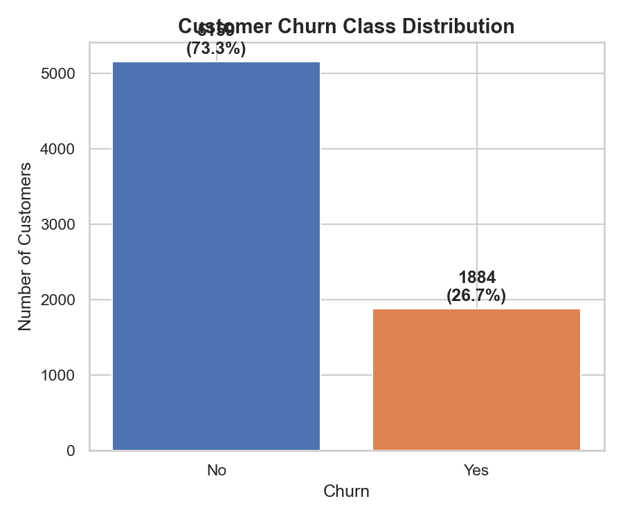
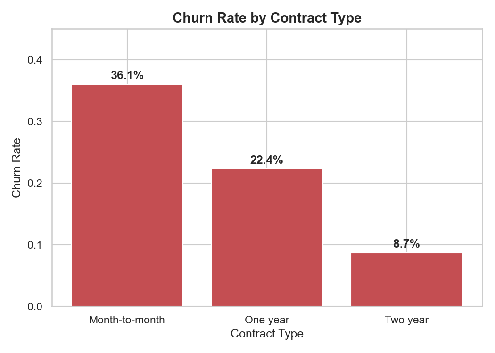
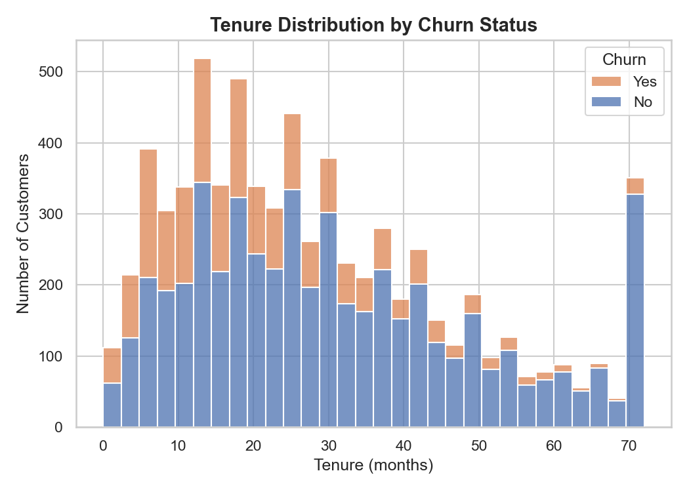
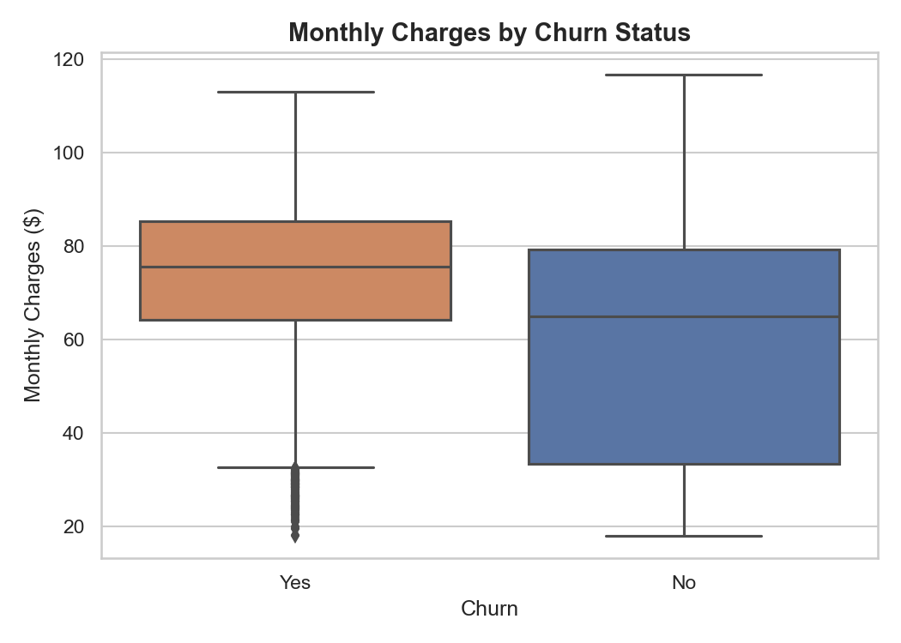
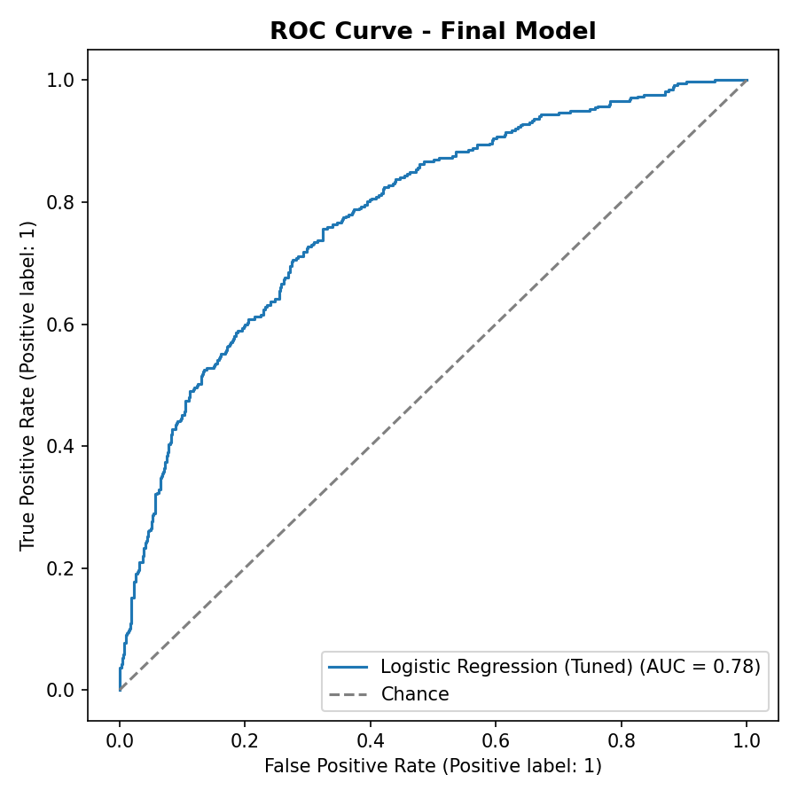
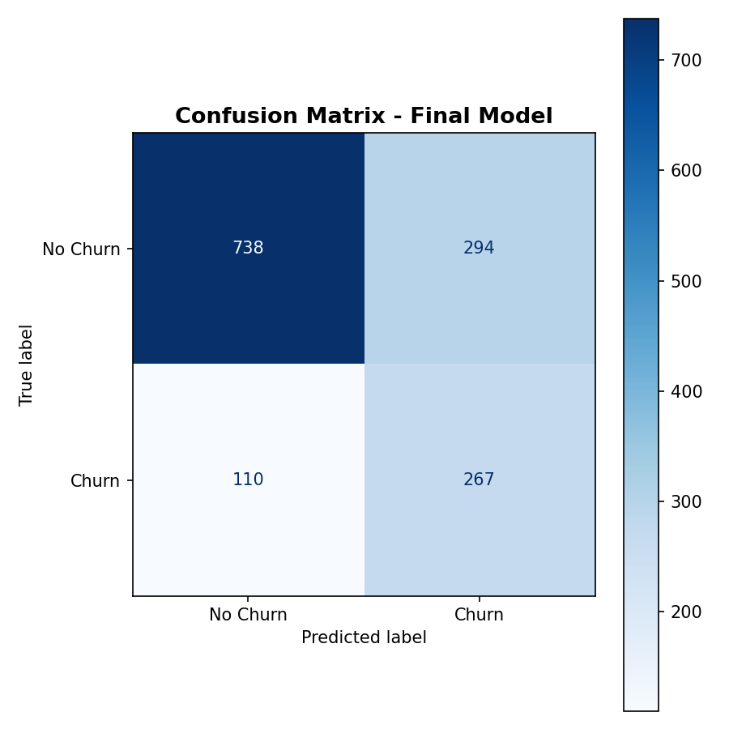
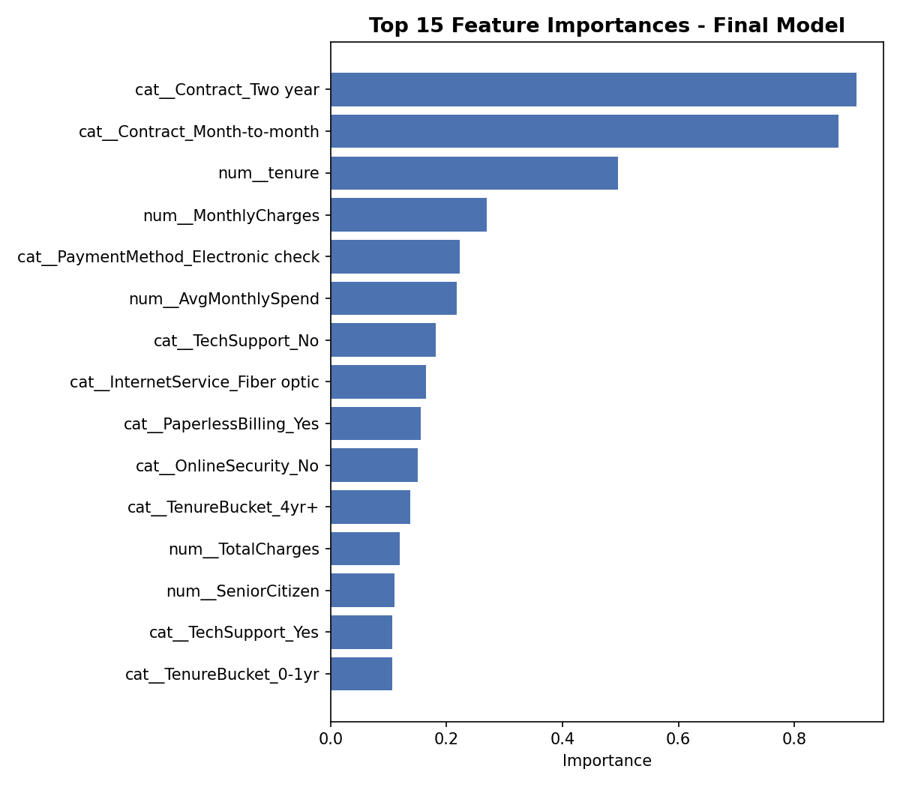

# Telecom Customer Churn Prediction

An end-to-end machine learning project that predicts which telecom customers
are likely to churn, so a retention team can act before they leave. Built to
demonstrate a complete, production-style ML workflow: synthetic data
generation, EDA, feature engineering, model comparison, hyperparameter
tuning, and deployment as a REST API.

## Problem Statement

Customer churn is one of the costliest problems in subscription businesses —
acquiring a new telecom customer typically costs 5-25x more than retaining
an existing one. This project builds a binary classifier that estimates the
probability a given customer will churn based on their account details,
service usage, and billing information, enabling proactive retention
campaigns (discounts, contract upgrades, support outreach) targeted at
high-risk customers.

**Note on data:** The dataset (`data/telecom_churn.csv`) is synthetically
generated (`src/generate_data.py`) to mirror the structure and statistical
patterns of the well-known IBM Telco Customer Churn dataset, with realistic
signal (contract type, tenure, charges) mixed with noise so it is not
trivially separable — this keeps the project fully self-contained and
reproducible without relying on external downloads.

## Approach

1. **Data generation** — 7,043 synthetic customer records with realistic
   churn drivers (month-to-month contracts, short tenure, high charges,
   lack of security/support add-ons, electronic check payment) plus random
   noise, calibrated to a ~27% churn rate matching real-world telecom
   benchmarks.
2. **EDA** — visualized churn distribution, churn rate by contract type,
   tenure distribution, and monthly charges by churn status to validate the
   signal and surface business insights.
3. **Preprocessing & feature engineering** — cleaned blank `TotalCharges`
   values, one-hot encoded categoricals, scaled numerics, and engineered
   4 new features: tenure buckets, average monthly spend, number of add-on
   services subscribed, and a "has streaming" engagement flag.
4. **Modeling** — trained and compared Logistic Regression, Random Forest,
   and XGBoost, all with SMOTE oversampling to handle class imbalance, then
   ran `RandomizedSearchCV` (5-fold CV, 12 candidate configs) to tune the
   best-performing model.
5. **Deployment** — packaged the winning pipeline (preprocessing + model)
   with `joblib` and served it behind a Flask REST API with a `/predict`
   endpoint and a browser-based test form.

## Key EDA Insights

| Insight | Finding |
|---|---|
| Overall churn rate | **26.75%** |
| Month-to-month contract churn | **36.1%** vs. **8.7%** for two-year contracts |
| Median tenure | Churned customers: **18 months** vs. retained: **28 months** |
| Median monthly charges | Churned customers: **$75.50** vs. retained: **$64.92** |

Contract type is by far the strongest churn signal — month-to-month
customers churn at more than **4x** the rate of two-year contract holders.
Short tenure and higher monthly charges compound the risk.






## Model Comparison

All models trained with SMOTE-balanced classes, evaluated on a held-out
20% stratified test set (n=1,409):

| Model | Accuracy | Precision | Recall | F1 | ROC-AUC | Train Time |
|---|---|---|---|---|---|---|
| Logistic Regression | 0.709 | 0.471 | 0.700 | 0.563 | **0.779** | 0.22s |
| Random Forest | 0.758 | 0.555 | 0.480 | 0.515 | 0.759 | 2.28s |
| XGBoost | 0.736 | 0.508 | 0.398 | 0.446 | 0.727 | 3.87s |

**Logistic Regression** had the best ROC-AUC and was selected for
hyperparameter tuning via `RandomizedSearchCV` (5-fold CV, scoring on
ROC-AUC).

- **Best params:** `C=0.01`, `penalty=l2`, `solver=lbfgs`
- **Best CV ROC-AUC:** 0.789

## Final Model Performance (Tuned Logistic Regression, held-out test set)

| Metric | Score |
|---|---|
| Accuracy | 0.713 |
| Precision | 0.476 |
| Recall | 0.708 |
| F1-score | 0.569 |
| ROC-AUC | **0.780** |

The model is tuned to favor **recall** over precision (via SMOTE + a
regularized linear model) — in a churn use case, the cost of missing an
at-risk customer (false negative) is typically much higher than the cost of
a wasted retention offer to a customer who wouldn't have churned (false
positive).





**Top churn drivers identified by the model:** two-year vs. month-to-month
contract type, tenure, monthly charges, electronic check payment method,
average monthly spend, and lack of tech support — all consistent with the
EDA findings above.

## Tech Stack

- **Data & modeling:** Python, pandas, NumPy, scikit-learn, XGBoost,
  imbalanced-learn (SMOTE)
- **Visualization:** Matplotlib, Seaborn
- **Model persistence:** joblib
- **Deployment:** Flask (REST API + HTML test form)

## Project Structure

```
Churn Prediction/
├── data/
│   └── telecom_churn.csv          # synthetic dataset (7,043 rows)
├── src/
│   ├── generate_data.py           # synthetic data generation
│   ├── eda.py                     # EDA plots + insights
│   ├── preprocessing.py           # cleaning + feature engineering
│   └── train_model.py             # training, tuning, evaluation
├── models/
│   └── churn_model.joblib         # final trained pipeline (preprocessing + model)
├── reports/
│   ├── figures/                   # all saved plots
│   ├── metrics.json               # final metrics + tuning results
│   ├── model_comparison.csv       # baseline model comparison
│   └── feature_importance.csv     # top feature importances
├── templates/
│   ├── index.html                 # browser test form
│   └── insights.html              # live EDA/metrics dashboard
├── app.py                         # Flask app (/predict, /insights)
├── requirements.txt
└── README.md
```

## How to Run Locally

### 1. Set up the environment

```bash
python -m venv venv
source venv/bin/activate   # Windows: venv\Scripts\activate
pip install -r requirements.txt
```

### 2. Reproduce the pipeline (optional — pretrained model is included)

```bash
python src/generate_data.py     # generate the synthetic dataset
python src/eda.py               # generate EDA plots
python src/train_model.py       # train, tune, evaluate, save the model
```

### 3. Run the Flask app

```bash
python app.py
```

Visit **http://127.0.0.1:5000/** in your browser for a form-based test UI,
and **http://127.0.0.1:5000/insights** for a live dashboard of the EDA
plots, model comparison table, and final metrics (the same charts embedded
below, served directly from `reports/figures/`) — or call the API directly:

```bash
curl -X POST http://127.0.0.1:5000/predict \
  -H "Content-Type: application/json" \
  -d '{
    "gender": "Female", "SeniorCitizen": 0, "Partner": "No", "Dependents": "No",
    "tenure": 2, "PhoneService": "Yes", "MultipleLines": "No",
    "InternetService": "Fiber optic", "OnlineSecurity": "No", "OnlineBackup": "No",
    "DeviceProtection": "No", "TechSupport": "No", "StreamingTV": "No",
    "StreamingMovies": "No", "Contract": "Month-to-month", "PaperlessBilling": "Yes",
    "PaymentMethod": "Electronic check", "MonthlyCharges": 85.5, "TotalCharges": 171.0
  }'
```

Example response:

```json
{
  "churn_prediction": "Yes",
  "churn_probability": 0.9203
}
```

A low-risk customer (long tenure, two-year contract, autopay) scores
**0.029** churn probability from the same endpoint — showing the model
responds sensibly across the risk spectrum.

## Deployment

The app is production-ready behind a WSGI server (`gunicorn`, included in
`requirements.txt`) and reads `PORT` from the environment, so it deploys
as-is to any container/PaaS host. Debug mode is off by default (enable
locally with `FLASK_DEBUG=1` if needed).

**Deploying to [Render](https://render.com) (free tier):**

1. Push this repo to GitHub.
2. On Render: **New → Web Service** → connect the repo.
3. Build command: `pip install -r requirements.txt`
4. Start command: `gunicorn app:app` (also defined in the included `Procfile`)
5. Deploy — Render assigns a public URL such as `https://your-app.onrender.com`.

The same `Procfile` + `requirements.txt` also work unmodified on Railway,
Heroku, or any other buildpack-based host.

## Possible Extensions

- Add SHAP explanations per-prediction for individual customer explainability
- Threshold tuning / cost-based decisioning (weight false negatives vs. false positives by business cost)
- Containerize the Flask app with Docker and add CI/CD
- Swap the synthetic dataset for a real telecom export via the same `src/preprocessing.py` pipeline

---

*Author: Himanshu Yadav*
